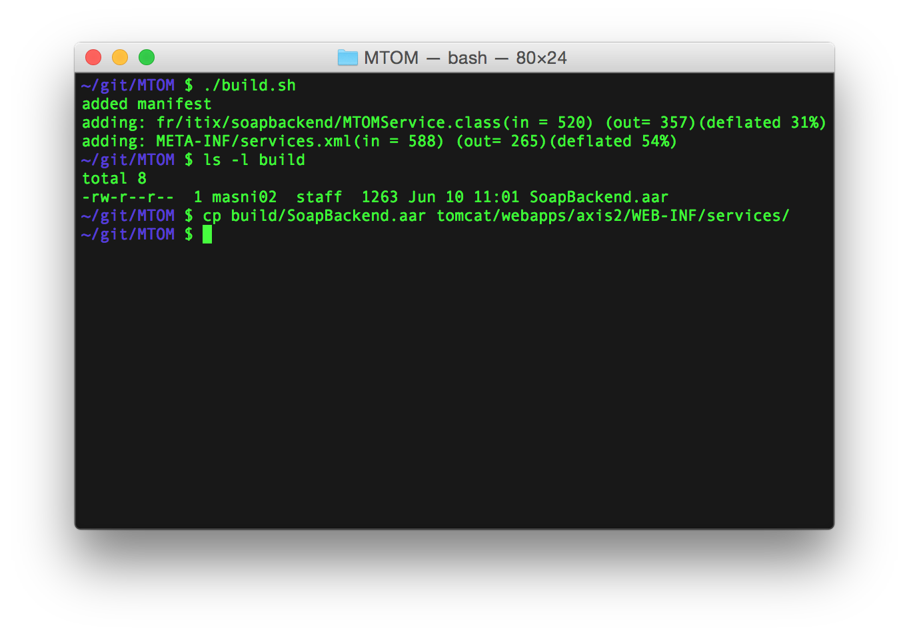

## MTOM Server Code Setup

### Pre-requisites

To make this sample code work, you need: 
 - Tomcat (tested against version 7)
 - Axis2 (tested against version 1.6)

Get tomcat7 and install it in a `tomcat` folder. 
```
$ wget http://www.eu.apache.org/dist/tomcat/tomcat-7/v7.0.62/bin/apache-tomcat-7.0.62.tar.gz && tar zxvf apache-tomcat-*.tar.gz && mv apache-tomcat-*/ tomcat
```

Get axis2 and install the axis2.jar in `tomcat/webapps/axis2`

```
$ cd tomcat/webapps
$ wget http://www.eu.apache.org/dist//axis/axis2/java/core/1.6.2/axis2-1.6.2-war.zip && unzip axis2-1.6.2-war.zip axis2.war
$ cd ..
$ ./bin/startup.sh
```

### Build

Build the .aar archive and deploy it. 




